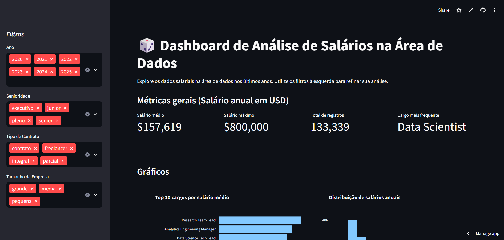
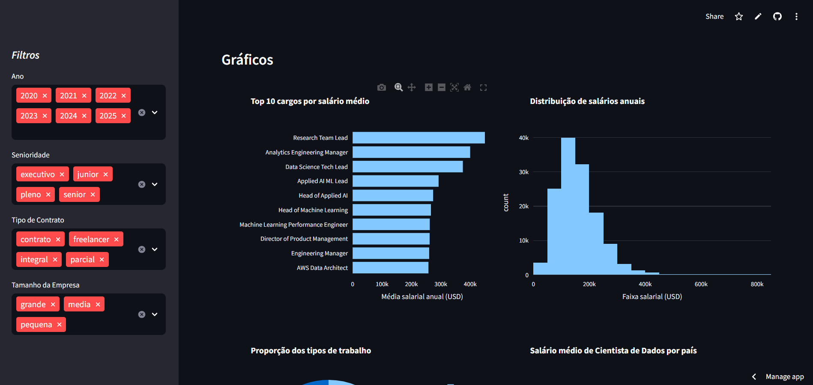
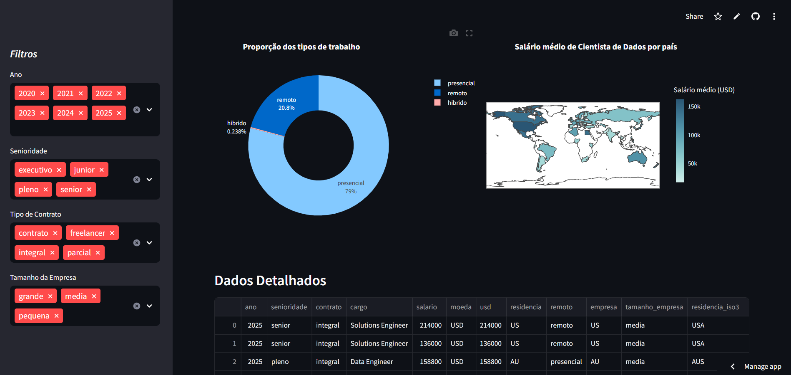

# 📊 Dashboard Interativo de Médias Salariais
## 📌 por Nível de Senioridade — Projeto de Imersão em Dados

🔗 **Acesse o dashboard online**  
👉 https://dashboard-interativo-python-imersao-alura-2025.streamlit.app/

⚠️ O app pode hibernar quando fica um tempo sem acessos. Se isso acontecer, basta recarregar a página.

---

## 📈 Sobre o projeto

Este projeto consiste em um **dashboard interativo** que apresenta médias salariais de desenvolvedores de software, organizadas por **nível de senioridade**.

Ele foi desenvolvido durante uma **imersão em dados com Python da Alura**, com foco em aprendizado prático e exploração das principais ferramentas da área de dados.

---

## 🎯 Objetivo

Os principais objetivos do projeto foram:
- praticar análise e tratamento de dados com Python
- aprender a criar visualizações interativas
- desenvolver um dashboard funcional com Streamlit
- dar os primeiros passos na área de dados e analytics

Este projeto tem caráter educacional e representa uma etapa inicial da minha jornada na área.

---

## 🛠️ Tecnologias Utilizadas

- Python
- Pandas — manipulação e análise de dados
- Plotly — gráficos interativos
- Streamlit — criação e publicação do dashboard
- Git & GitHub — versionamento do projeto

---

## 📊 Funcionalidades

- Visualização das médias salariais por senioridade
- Comparação entre diferentes níveis de carreira
- Interface simples e interativa
- Gráficos dinâmicos para facilitar a análise dos dados

---

## 🖼️ Screenshots do Dashboard

### Visão geral do dashboard


### Médias salariais por senioridade


### Comparação entre níveis


---

## 📚 Principais aprendizados

Durante o desenvolvimento deste projeto tive contato com:

- manipulação de dados com Pandas;
- criação de dashboards interativos;
- visualização de dados com Plotly;
- publicação de aplicações utilizando Streamlit;
- organização de projetos em Python utilizando Git.

---

## 🚀 Como executar localmente

### Clone o repositório
```bash
git clone https://github.com/clara-paterno/Dashboard-Interativo-Python.git
```

### Entre na pasta do projeto
```bash
cd Dashboard-Interativo-Python 
```

### Crie e ative o ambiente virtual
```bash
python -m venv 
.venv .venv\Scripts\Activate (Windows) 
source .venv/bin/activate (Mac/Linux) 
```

### Instale as dependências
```bash
pip install -r requirements.txt 
```

### Execute o app
```bash
streamlit run app.py
```

---

## 🔗 Contato
- 💼 LinkedIn: https://www.linkedin.com/in/maria-clara-paterno-maia-9450b73aa
- 🐙 e-mail: mclara.paterno@gmail.com


